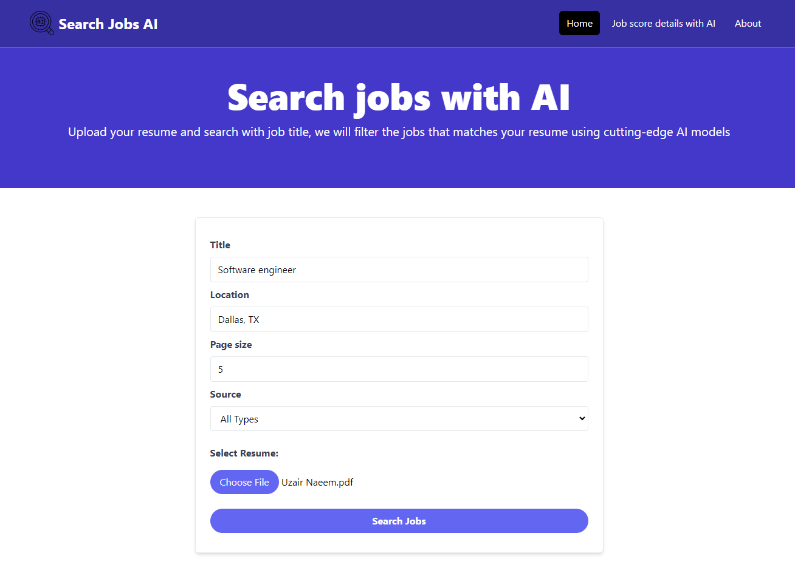
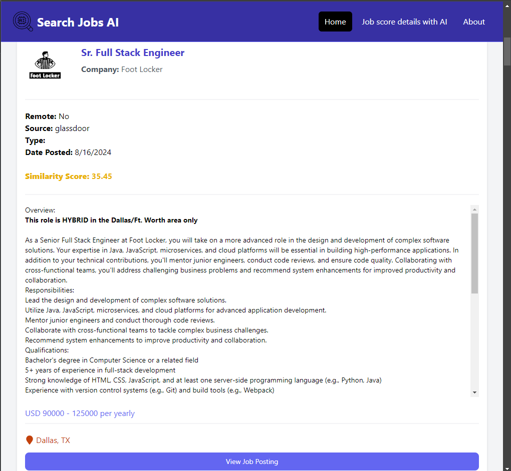

# 🚀 Job Search Optimization Tool 🚀

[Job Search deployed on Github pages](https://uzairnaeem015.github.io/JobSearchAI/)

[GitHub repo](https://github.com/uzairnaeem015/JobSearchAI)




## Project Summary

This tool is designed to streamline the job application process by providing similarity scores between job descriptions and resumes. Additionally, it leverages Google Gemini to offer insights on how to improve the resume to increase alignment with job postings. The project addresses the challenge of optimizing resumes for each job application efficiently, providing a free and effective alternative to paid online tools.

## Solution

### Challenges & Approach
- **Data Access:** Major job platforms do not provide accessible APIs for job data unless you have an organization account, which is often paid. To overcome this, I used the open-source library "Jobspy" to scrape job postings from Indeed, LinkedIn, and Glassdoor.
- **Similarity Scoring:** Implemented various NLP techniques to calculate similarity scores between job descriptions and resume content:
  - **Cosine Similarity** and **Euclidean Distance** using:
    - **Doc2Vec** (custom-trained on a Kaggle dataset)
    - **CountVectorizer**
    - **TF-IDF Vectorizer**
  - **Sentence Similarity** using **BERT**
- **AI Integration:** Google Gemini (1.5 Flash model) is used for generating resume improvement suggestions with custom prompts, making use of over 1,500 requests per day on a free account.

### Tech Stack

- **Frontend:** React, Vite, Tailwind CSS
- **Backend:** Python, FastAPI
- **Deployment:**
  - Frontend: GitHub Pages
  - Backend: Docker on Render

## Future Work

1. **Enhanced LLM Integration:**
   - Refine Google Gemini prompts for more detailed explanations.
   - Explore integration of local LLMs (e.g., GPT4ALL) for more extensive analysis, despite their current limitations with larger token sizes.
2. **Database Implementation:**
   - Introduce a database to store job data for quick access, with a cron job to automate data collection.
3. **API Development:**
   - Replace web scraping with a robust RESTful API for accessing job data.

## Running the Project Locally

### Prerequisites

- **Node.js** and **npm** installed for the frontend.
- **Python** and **pip** installed for the backend.
- **Docker** (optional, for containerized backend deployment).

### Frontend Setup

1. Clone the repository:
   ```bash
   git clone https://github.com/uzairnaeem015/JobSearchAI.git
   cd JobSearchAI/frontend/jobsearchfe

2. Install dependencies:
   ```bash
    npm install
   
3. Run the development server:
   ```bash
    npm run dev

4. Open your browser and navigate to http://localhost:3000


### Option 1: Backend Setup locally
   
1. Navigate to the backend directory:
   ```bash
   cd backend

2. Create a virtual environment and activate it:
    ```bash
    python -m venv venv
    source venv/bin/activate   # On Windows use `venv\Scripts\activate`

3. Install dependencies:
   ```bash
   pip install -r requirements.txt

4. Run the backend server:
   ```bash
   uvicorn main:app

5. The backend will be available at http://localhost:8000.

### Option 2: Run backend with Docker

1. Ensure Docker is installed and running.
2. Build and run the Docker container:

    ```bash
    docker build -t job-search-backend .
    docker run -d -p 8000:8000 job-search-backend
     

## Contributing
Contributions are welcome! Please submit a pull request or open an issue to discuss changes.

## License
This project is licensed under the MIT License. See the LICENSE file for details.

## Acknowledgements
1. [Jobspy](https://github.com/Bunsly/JobSpy) - For enabling web scraping to collect job data.
2. [Google Gemini](https://gemini.google.com/) - For providing AI-driven resume improvement suggestions.

